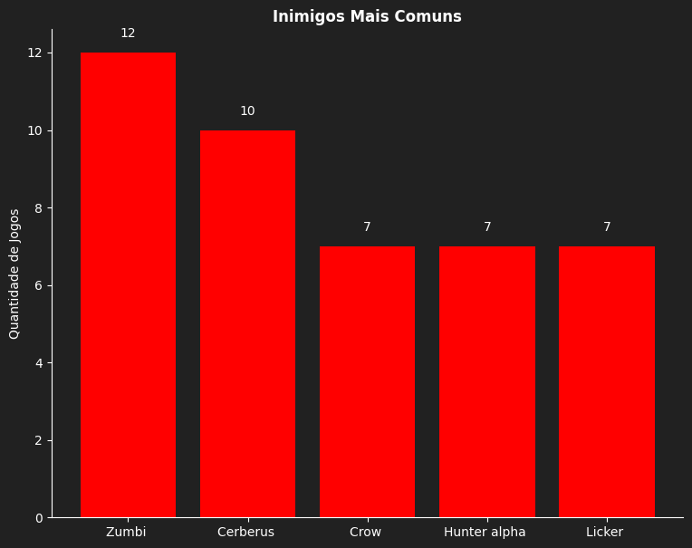
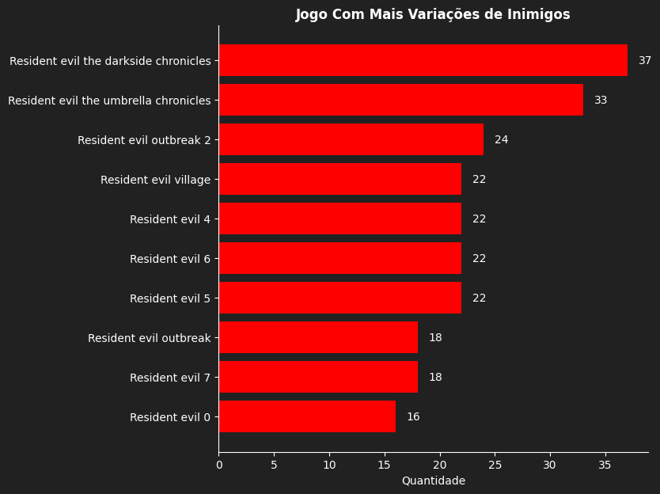
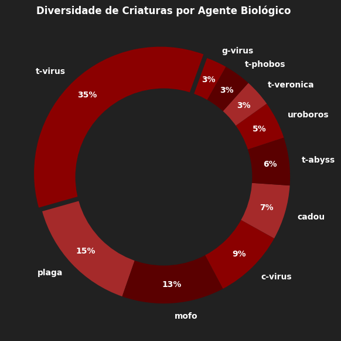

# ☣️ Resident Evil: Biological Data Analysis

Este projeto realiza uma análise de dados sobre os monstros da franquia **Resident Evil**, focando na evolução dos agentes biológicos e na diversidade de criaturas ao longo dos principais títulos da série.

## 📌 Objetivos do Projeto
* **Mapear a Recorrência:** Identificar quais criaturas estão mais presentes em diferentes jogos.
* **Taxonomia Viral:** Analisar a diversidade de cada agente biológico (t-virus, Plagas, Mofo, etc).
* **Densidade por Título:** Verificar quais jogos apresentam o catálogo de inimigos mais vasto.

## 🛠️ Tecnologias e Ferramentas
* **Python 3.x**
* **Pandas:** Manipulação de dados e tratamento dos dados.
* **Matplotlib:** Criação e visualização de gráficos.
* **Jupyter Notebook:** Ambiente de desenvolvimento e documentação.

## 🎮 Jogos Usados na Análise
* **Resident evil 0**
* **Resident evil 1**
* **Resident evil 2 remake**
* **Resident evil 3 remake**
* **Resident evil outbreak 1**
* **Resident evil outbreak 2**
* **Resident evil the umbrella chronicles**
* **Resident evil the darkside chronicles**
* **Resident evil code veronica**
* **Resident evil 4 remake**
* **Resident evil survivor**
* **Resident evil dead aim**
* **Resident evil 5**
* **Resident evil 6**
* **Resident evil 7**
* **Resident evil village**

## 📊 O Dataset
O dataset utilizado neste projeto foi criado manualmente por mim, através de uma pesquisa detalhada na lore da franquia Resident Evil. Foram catalogadas mais de 230 criaturas, cruzando informações de agentes biológicos e aparições em cada título. As informações foram coletadas a partir de wikis da comunidade e materiais oficiais da franquia.

## 📊 Insights Principais
1. **Inimigos Icônicos:** Fora os *zumbis* convencionais, *Cerberus* são os inimigos que mais aparecem em jogos diferentes.Seguidos dos *Crows*, *Hunter alpha* e *Lickers*.

2. **Era das Crônicas:** Os títulos *The Umbrella Chronicles* e *The Darkside Chronicles* lideram em variedade por servirem como compilações históricas.

3. **Soberania do t-virus:** Mesmo com décadas de evolução, o t-virus ainda é responsável por ~30% da diversidade biológica da série.

## 📂 Estrutura do Repositório
* `analise.ipynb`: Notebook contendo todo o código de ETL e visualização.
* `dataset-monstros.csv`: Base de dados customizada criada para este projeto.

## 🚀 Como visualizar
1. Clone o repositório.
2. Certifique-se de ter o `Pandas` e o `Matplotlib` instalados.
3. Abra o arquivo `analise.ipynb` em seu ambiente Jupyter ou VS Code.
---
Desenvolvido por mim para treinamento em estudos de análise de dados com pandas e matplotlib.
[LinkedIn](linkedin.com/in/guilherme-chuisso-21b555203)